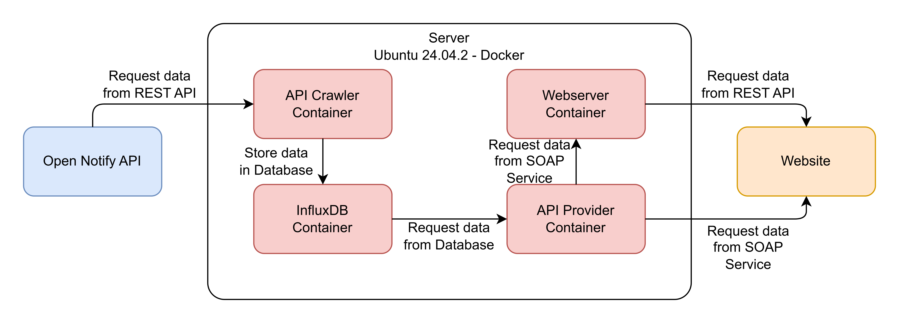
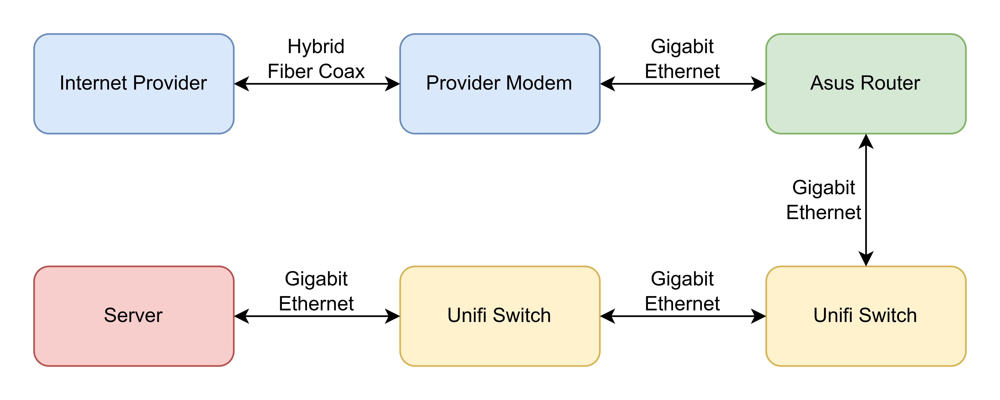

# SYI-IP-Group5
Systems Integration - Integration Project - Group 5

# Logical Overview


## Open Notify API
The Open Notify API is where we get the data from. It is a REST/JSON API and an example response can be seen below:
```
{
  "timestamp": 1749508154,
  "message": "success",
  "iss_position": {
    "longitude": "-111.3506",
    "latitude": "38.1675"
  }
}
```
More details on this API are available here: http://open-notify.org/Open-Notify-API/ISS-Location-Now/

## Server
The Server is using the x86-64/AMD64 version of Ubuntu Desktop 24.04.2 LTS as the operating system. On top of the OS Docker was installed. Four parts of our system are contained in separate docker containers.

### API Crawler
The API crawler container consists of an Ubuntu OS image as its base and a custom Python application on top. This custom python application uses the [schedule library](https://pypi.org/project/schedule/) to call the method to request data from the Open Notify API every minute on the minute. The API calls are performed with the [requests library](https://pypi.org/project/requests/). The response data is converted into a JSON object and then checked against the JSON schema with the [jsonschema library](https://pypi.org/project/jsonschema/). After the data is validated and converted it can be stored in the InfluxDB database with the [influxdb-client library](https://pypi.org/project/influxdb-client/).

### InFluxDB
The InfluxDB container consists of a pre-made InfluxDB v2.7.12 image. A user account, an organization and a data bucket were configured. Additionally, tokens to access the data bucket were generated. HTTPS was enabled with a custom certificate based on a custom certificate authority.

#### Deviation certificates
The following commands were used to create the necessary certificates:
Root CA key
```
openssl genrsa -des3 -out ca.key 2048
```
Root CA certificate (fill out country, state, and organizational unit name)
```
openssl req -new -x509 -days 3650 -key ca.key -out ca.crt 
```
Server key
```
openssl genrsa -out server.key 2048
```
Server certificate request (fill out country, state, organizational unit name and common name)
```
openssl req -new -out server.csr -key server.key 
```
The server certificate requires a separate subjectAltName.conf file like below
```
basicConstraints=CA:FALSE
subjectAltName=@my_subject_alt_names
subjectKeyIdentifier = hash

[ my_subject_alt_names ]
DNS.1 = server.local
DNS.2 = server
```
Server certificate
```
openssl x509 -req -in server.csr -CA ca.crt -CAkey ca.key -CAcreateserial -out server.crt -days 3650 -extfile subjectAltName.conf
```

### API Provider
The API provider container consists of an Ubuntu OS image as its base and a custom Python application on top. This custom python application provides a SOAP/XML service over HTTPS with the [spyne library](https://github.com/arskom/spyne) and the [aiohttp-spyne](https://pypi.org/project/aiohttp-spyne/) library. To be able to use the SOAP service in the browser CORS needed to be configured with the [aiohttp_cors library](https://pypi.org/project/aiohttp-cors/). Incoming SOAP API requests are validated with the [lxml library](https://pypi.org/project/lxml/). The requests to the InfluxDB database are performed with the [influxdb-client library](https://pypi.org/project/influxdb-client/) and a FluxQuery. While the location history is straight forward this is not the case for the closest entry by timestamp feature. The request for the closest entry by timestamp is using a starting timerange of one minute before and after the provided timestamp and extending in a loop until at least one entry was found or a maximum of one hour before and after the provided timestamp was reached at which point the search is aborted. Furthermore, when requesting the closest entry by timestamp the [pandas library](https://pypi.org/project/pandas/) is used to help identify the entry with the smallest timedelta. Lastly the response entries from the InfluxDB are converted into custom LocationRecord instances and send as XML data to the client.

#### Deviation build current spyne version
The current pip version of spyne is outdated and doesn't work on Python 3.12.
The updated version of spyne can be built with the [build library](https://pypi.org/project/build/) from the spyne directory with the following command:
```
python3 -m build
```
After the library was built it can be installed with the following command (note that your version might be different):
```
pip3 install spyne/dist/spyne-2.15.0a0-py3-none-any.whl
```

### Webserver
TODO

# Hardware Setup
## Physical Overview


## Internet Provider
The internet provider provides a broadband internet connection with a public IPv4 address.

## Provider Modem
The provider modem acts as a bridge/media converter between the HFC network and the Asus router.

## Asus Router
The Asus router has Dynamic DNS with a Let's Encrypt certificate and port forwarding configured. Additionally, the OpenVPN Server provides access to collaborators.

## Unifi Switches
The Unifi switches are only included for completeness.

## Server
As the server a [MSI Cubi MS-B096](https://www.msi.com/Desktop/Cubi/Specification) mini-PC with the following components was used:

- An [Intel Celeron 3205U](https://www.intel.com/content/www/us/en/products/sku/84809/intel-celeronprocessor-3205u-2m-cache-1-50-ghz/specifications.html) mobile dual-core processor from 2015 with a frequency of 1.5 GHz, which is based on the Broadwell microarchitecture (5th gen Core i/m) and manufactured on Intel 14 nm process
- A pair of [SO-DIMMs with four Gigabyte of Samsung DDR3L 1600 MT/s memory](https://download.datasheets.com/pdfs/2013/2/4/7/40/1/537/sam_/manual/ddr3_product_guide_dec_12-0.pdf) in dual-channel (total of eight Gigabyte)
- A [32 Gigabyte mSATA Transcend SSD](https://cdn.transcend-info.com/products/images/modelpic/1059/Transcend-MSA370_202306.pdf) with DRAM cache
- A Realtek Gigabit Ethernet Controller

 As the operating system the x86-64/AMD64 version of Ubuntu Desktop 24.04.2 LTS was used.
